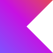

<h2 align="center">

**Hey there 👋 Welcome back**

</h2>

[<b>Portfolio↗</b>](https://04burhanuddin.github.io "My portfolio")

<h3>

 **About me 💫**
</h3>

- 💻 I’m Freelance Software Developer.
- ♂ Pronouns **He**.
- 🎓 I'm a fresh graduate from **Universitas Teknologi Digital Indonesia**, Bachelor of Computer Science.
- 🌱 I’m currently learning **Mobile Developer**, **Flutter** and **Kotlin**.
- ⚡ Fun fact I think i'm not funny 👾

 

<b>Experience:</b>

  
  
  
  
  
  
  
  
  
  
  
  
  
  

