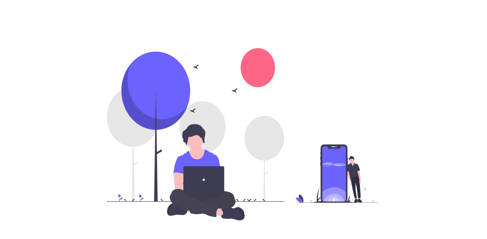

<!-- top -->
<h1 align="center">Hi 👋, I'm Burhanuddin</h1>

<!-- connect me -->

  
   

<!-- end connect me -->

  <a href="https://github.com/04burhanuddin">
   
  </a>

<!-- end top -->

<!-- license -->

<!-- content -->
- 🌱 I’m currently learning **Frameworks and Other Programming Language**
- 😄 Pronouns: He/His
- ⚡ Fun fact **I think i'm not funny😈**
<!-- end content -->

<!-- user -->

  <h3><b>I'm User</b></h3>
  
  
  

<!-- end user -->

<!-- editor -->

  <h3><b>My vaforit editor & tools</b></h3>
  <!-- comment -->
  
  <!-- end comment -->
  
  
  
  

<!-- end editor -->

<!-- learn -->

  <h3><b>🌱 I'm Always Learning</b></h3>
   
   
   
   
   
  
    
  
  
  

<!-- end learn -->

<!-- github -->
<!-- 

  <a href="https://github.com/04burhanuddin">
  

  -->
<!-- end github -->